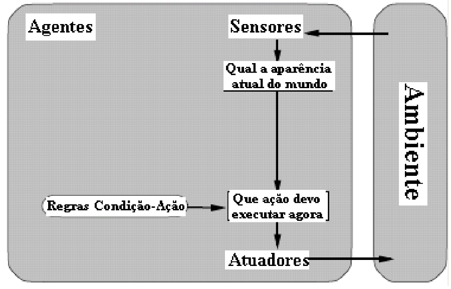

# Agentes Inteligentes :robot:

Prof. Me. Alexandre Henrick

Sistemas de Informação - 8º P

---

### IA como um campo multidisciplinar

* Filosofia: Conexão entre o conhecimento e a ação. Questão vital para a IA, porque inteligência exige ação, bem como raciocínio.
* Matemática: Lógica, computação e probabilidade;
* Psicologia: Como os seres humanos pensam e agem?
* Neurociência: Como o cérebro processa informações?
* Linguística: Processamento de linguagem natural
* Biologia: Inspiração na natureza para construção de algoritmos.

---
### Agentes inteligentes em IA

Um agente é tudo que pode ser considerado capaz de perceber seu ambiente por meio de **sensores e de agir sobre esse ambiente por intermédio atuadores**. 

---

### Agentes inteligentes em IA

* **Mais uma definição para IA**: É o estudo de agentes inteligentes que recebem percepções do ambiente e executam ações.
* **Ideia dos agentes inteligentes**: sistemas que podem decidir o que fazer e quando fazer de forma autônoma.

---

### Agentes racionais

* **Se um agente é autônomo e executa suas tarefas com perfeição, seria ele racional?** No contexto deste tema, dizemos que um sistema é racional se "faz tudo certo", com os dados que tem.
* **Agente racional**: É aquele que age para alcançar o melhor resultado ou, quando há incerteza, o melhor resultado esperado.

---

Um agente é tudo que pode ser considerado capaz de perceber seu ambiente por meio de **sensores e de agir sobre esse ambiente por intermédio atuadores**. 


---

### Exemplos de agentes

* Agente humano:
    - Sensores: Olhos, ouvidos, nariz..
    - Atuadores: Mãos, pernas, bocas

    &nbsp; 

* Agente robótico:
    - Sensores: Câmeras e outros sensores
    - Atuadores: Motores

---
### Elementos funcionais de um agente

* **Percepção**: fazer referência às entradas perceptivas do agente em qualquer momento dado.

* **Seqüência de Percepções do Agente**: é a história completa de tudo que o agente percebeu. Em Geral: a escolha de ação de um agente em qualquer instante dado pode depender da seqüência inteira de percepções observadas até o momento.

---

* **Função de Agente**: descreve o comportamento do agente através do mapeamento para qualquer seqüência de percepções específica para uma ação.

* **Programa do Agente**: é uma implementação concreta da função de agente, relacionada à arquitetura do agente.

---

* Desenho que representa um agente reativo simples e seus componentes.



---

### Mapeando percepções em ações

* Chamamos de **função do agente** o mapeamento de uma sequência de percepções para uma ação.


---

* Considere que estamos construindo um agente **Aspirador de Pó**:

    * Percepções do agente: Local e conteúdo:
        - Exemplo: [A, limpo], [B, sujo]


    * Ações: Esquerda, Direita, Aspirar, Desligar

---


---

### Voltando aos agentes racionais...

* Para cada sequência perceptiva, um agente racional deve selecionar a ação que **maximize** seu resultado (aquele que se comporta da melhor maneira possível em um ambiente).
* Como saber se esse agente está performando bem?

---

### Medidas de desempenho

* Critério que define o grau de sucesso de um agente na realização de uma dada tarefa;
* Para o exemplo do aspirador, podemos definir algumas medidas de desempenho, como:
    * Maximiza a quantidade de locais limpos em 12 horas;
    * Minimiza a quantidade de sujeira no chão

---

### Agente racional ideal

Para cada sequência de percepções o agente escolhe a ação que maximiza seu desempenho baseado nas informações de percepções e de seu conhecimento sobre o mundo.

---

### Onde está a IA nesse contexto:

* Em um projeto de agente inteligente, a IA se preocupa em desenvolver o **programa do agente**: a função que implementa o mapeamento entre percepção e ação.

* O programa roda em uma arquitetura: dispositivo de computação que inclui sensores e atuadores.

agente = arquitetura + programa

---

### PEAS

* Para projetar um agente, precisamos definir os seguintes componentes:
    * **P**erformace = Medida de desempenho
    * **E**nvironment = Ambiente
    * **A**ctuators = Atuadores
    * **S**ensors = Sensores

---

### PEAS - Sistema de diagnóstico médico

* Medida de desempenho: paciente saudável
* Ambiente: paciente, hospital, equipe
* Atuadores: exibir na tela as perguntas, testes, diagnósticos, tratamentos
* Sensores: entrada pelo teclado para sintomas, descobertas, respostas do paciente

---

### PEAS - Robô de seleção de peças

* Medida de desempenho: porcentagem de peças em bandejas corretas
* Ambiente: correia transportadora com peças, bandejas
* Atuadores: braço e mão articulados
* Sensores: câmera, sensores angulares articulados

---

### Tipos de ambientes em IA

Saber qual tipo de ambiente o agente irá atuar nos ajuda a determinar quais tipos de agentes devemos construir.

---

### Totalmente observável VS Parcialmente observável

* Se o sensor consegue detectar o estado completo do ambiente a cada ponto, é um ambiente totalmente observável

* **Xadrez**: o tabuleiro é totalmente observável a cada movimento
* **Dirigindo**: parcialmente observável, a cada curva o ambiente muda

---

### Determinístico VS Estocástico

* Determinístico: o próximo estado é completamente determinado pelo estado atual e pela ação executada pelo agente. Ex Xadrez
* Estocástico: quando existe uma certa aleatoriedade envolvida. Ex: O clima

---

### Episódico VS Sequencial

* Episódico: o agente recebe uma percepção e executa uma ação (episódio atômico). Ex: robô aspirador
* Sequencial: a decisão atual afeta as decisões futuras. Jogo com diferentes finais

---

### Estático VS Dinâmico

* Estático: se o ambiente não muda enquanto o agente atua, então é o estático
* Dinâmico: ao contrário do estático

---

### Contínuo VS Discreto

* Discreto: se o ambiente tiver um número finito de estados. Ex: jogo da velha. Sabemos o número de jogadas possíveis.
* Contínuo: quando o agente deve lidar com grandezas contínuas. Ex: Temperatura de um ambiente.

---


---

### Tipos básicos de agentes

* Agente Reativo Simples;
* Agente Reativo Baseado em Modelos;
* Agente Baseado em Objetivos;
* Agente Baseado em Utilidade

---

##### Agente Reativo Simples
* Age com base em estimulos imediatos. Não considera o histórico ou futuro


---
##### Agente Reativo Simples

* Fazemos um "mapeamento" das percepções para as regras de **condição-ação** pré-estabelecidas.

```
function AGENTE-REFLEXO-SIMPLES(percepção): ação
    static: regras (um conjunto regra condição-ação)

    estado ← INTERPRETA-ENTRADA(percepção)
    regra ← CASAMENTO-REGRA(estado, regras)
    ação ← AÇÃO-REGRA[regra]

    return ação
```

---

##### Agente Baseado em Modelos
* Armazena estado interno do ambiente. Consegue interpretar como ambiente evolui.


---

##### Agente Baseado em Modelos

* O **estado interno** precisa ser atualizado para a tomar a melhor decisão. Para isso, são necessários dois conhecimentos:
    * Como o ambiente evoluí
    * Como as ações do agente afetam o ambiente 

---
##### Agente Baseado em Modelos

Função do agente

```
function AGENTE_REFLEXO_COM_ESTADO(percepção):ação
    static: estado (uma descrição do estado atual do mundo)
        regras (um conjunto regra condição-ação)
    estado ← ATUALIZA-ESTADO(estado,percepção) # Cria nova descrição do estado interno
    regra ← CASAMENTO-REGRA(estado,regras)
    ação ← AÇÃO-REGRA[regra]

    return ação
```
---

##### Agente Baseado em Objetivos
* As ações são guiadas por um objetivo definido. Verifica se o objetivo foi atingido (medida de desempenho); Repete o processo até que o mesmo seja atingido. **Objetivo != regra de condição-ação**


---

##### Agente Baseado em Objetivos
* O agente irá escolher ações que o aproxime dos objetivos
* Agentes reativos: reação -> frear qdo carro da frente frear
* Agentes baseado em objetivo: raciocínio -> carro da frente freia -> carro da frente diminui velocidade -> objetivo: não atingir outros carros -> ação para atingir objetivo: frear

---

##### Exemplo de Agente Baseado em Objetivos

- Agente que aprende a digitar seu nome:

    - Objetivo: Nome completo da pessoa;
    - Medida de desempenho: Quantidade de letras na posição correta

---

##### Agente Baseado em Objetivos

* O agente que funciona orientado a objetivos é mais **flexível**
    * Agente reativo simples -> ações pré-compiladas (condição-ação)
    * Agente p/ objetivo -> pode alterar somente o objetivo sem necessidade de se reescrever as regras de comportamento

---

##### Agente Baseado em Utilidade
Ações baseadas em **maximizar o valor de utilidade**. Medida numérica do sucesso. Ex: Sistemas de recomendação


---

##### Agente Baseado em Utilidade
* **Utilidade** é uma função que mapeia um estado para um número real que representa o grau de satisfação com este estado

---

##### Agente Baseado em Aprendizagem
Utilizam a **experiência** para melhorar seu desempenho ao longo do tempo.


---

##### Agente Baseado em Aprendizagem
* Em agentes sem aprendizagem tudo o que o agente sabe foi colocado nele pelo projetista
* Turing propõe construir máquinas com aprendizagem e depois ensina-las
* Aprendizagem também permite ao agente atuar em ambientes totalmente desconhecidos e se tornar mais competente do que o seu conhecimento inicial poderia permitir

---

##### Agente Baseado em Aprendizagem
* Sistema de recomendação de música:
    * Coleta dados sobre a interação do cliente com a plataforma
    * Faz sugestões
    * Melhora com feedbacks

---

##### Quatro componentes conceituais de um Agente com Aprendizagem

* Elemento de aprendizado: 
    * Utiliza realimentação do crítico sobre como o agente performa
    * Determina as mudanças necessárias para o elemento de desempenho


* Crítico: 
    * Informa ao elemento de aprendizado como o agente está se comportando
    * O agente não deverá modificá-lo

---

* Elemento de desempenho:
    * Responsável pela seleção das ações externas
    * Recebe percepções e decide sobre ações

* Gerador de problemas:
    * Responsável por sugerir ações que levarão a experiências novas e informativas
    * Ações não ótimas a curto prazo para descobrir ações ótimas a longo prazo

---

##### Agente Motorista com Aprendizagem

* Elemento de desempenho: conhecimento e procedimentos para dirigir
* Crítico: observa o mundo e repassa para o elemento de aprendizagem a reação dos outros motoristas a uma ação do agente

---

* Elemento de aprendizagem:
    * É capaz de formular uma regra afirmando que a ação foi boa/ruim
    * Modifica o elemento de desempenho pela instalação da nova regra
    * Aprendizado por experiência acontece aqui!

* Gerador de problemas:
    * Identifica áreas que precisam de melhorias
    * Sugere experimentos: testar freios em diferentes superfícies

---

### Referência

* Russell, S. J. 1., & Norvig, P. (1995). Artificial intelligence: a modern approach. Englewood Cliffs, N.J., Prentice Hall.
