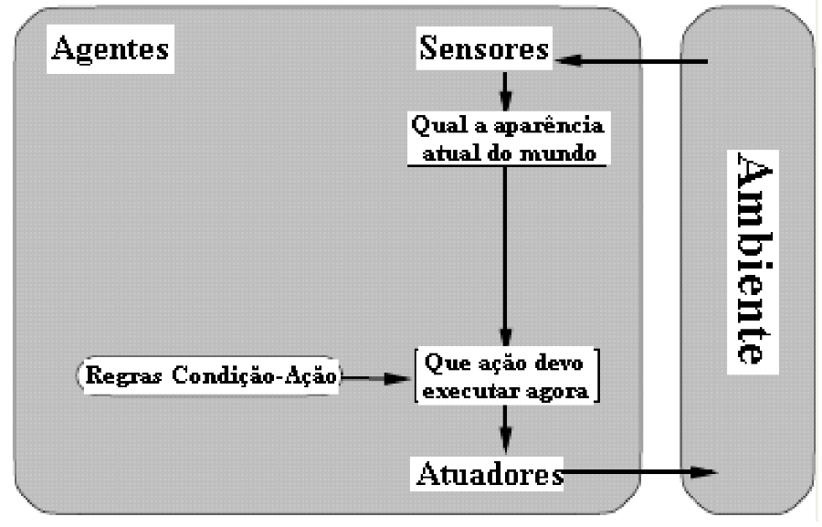

<table>
  <tr>
    <td>
        
    </td>
    <td>
      <H4>Prof. Me. Alexandre Henrick</H4> <H4>Inteligência Artificial - 8º período Sistemas de Informação</H4>
    </td>
  </tr>
</table>

---

<H1>Introdução a Inteligência Artificial</H1>

**Definição**

<table>
  <tr>
    <td>
      
    </td>
    <td>
      <i>"A inteligência artificial é o estudo de como fazer os computadores realizarem tarefas que, no momento, os humanos fazem melhor". (Norvig, 1995)</i>
    </td>
  </tr>
</table>

Na definição de Norvig, podemos ver que o foco da IA foi, e ainda é, desenvolver métodos computacionais que realizem tarefas tão bem ou até melhor que algum humano.

---

**A história resumida em uma linha do tempo**

- Década de 1940:

    - 1943: McCulloch e Pitts - Proposta de um modelo de neurônio artificial. O objetivo era fazer uma associação entre os neurônios biológicos e circuitos eletrônicos.

- Década de 1950:

    - 1950: Alan Turing propõe o "Teste de Turing" como um método para determinar a inteligência de uma máquina. O principal objetivo do Teste de Turing era fornecer uma definição operacional e prática para a inteligência em máquinas. Turing estava interessado em responder à pergunta: "As máquinas podem pensar?" No entanto, ele percebeu que definir "pensar" era uma tarefa complexa e filosófica demais. Em vez disso, ele propôs um teste que se concentraria na capacidade de uma máquina exibir comportamento inteligente indistinguível do comportamento humano.

        "O computador passará no teste se um interrogador humano, depois de propor algumas perguntas por escrito, não conseguir descobrir se as respostas escritas vêm de uma pessoa ou não".

        Para Turing, o computador precisaria apresentar as seguintes capacidades:
            
            - Processamento de linguagem natural (comunicação);
            - Representação do conhecimento (armazenar o que sabe);
            - Raciocínio automatizado (tirar conclusões a partir das perguntas);
            - Aprendizado de máquina (adaptar-se à novas circunstâncias)

        Teste de Turing Total: 
            
            - Visão computacional (perceber objetos);

            - Robótica (movimentar-se e manupular objetos)

    - 1956: A Conferência de Dartmouth marca o início oficial da pesquisa em inteligência artificial (IA) como um campo de estudo.
    
    &nbsp; 

- Década de 1960:

    - 1966: O programa "ELIZA", criado por Joseph Weizenbaum no MIT, demonstra a capacidade de uma máquina para conduzir conversas simples como um terapeuta. Foi um dos pilares do processamentode linguagem natural (NLP). Simulava uma conversa com um terapeuta, usando padrões de reconhecimento em palavras-chave e transformações de frases para responder os inputs dos usuários. É considerado um "chatbot primitivo".

    &nbsp; 

- Década de 1970:

    - 1972: O sistema "MYCIN" é desenvolvido para diagnosticar infecções sanguíneas, sendo um dos primeiros sistemas de IA aplicados na medicina. Desenvolvido como parte do Doutorado de Edward Shortliffe, foi o primeiro sistema especialista de IA aplicado na medicina. Utilizava como mecanismo a **inferência baseada em regras**.
    - 1974: O sistema "R1/XCON" é desenvolvido para configurar sistemas de computador, marcando um avanço em sistemas especialistas. Um dos pioneiros na aplicação da IA na indústria.
        - O R1 (Reactor One) era um sistema baseado em regras que auxiliava engenheiros a escolher a melhor configuração de hardwares e softwares, auxiliando na seleção desses componentes.
        - XCON (Expert Configurer): Evolução do R1 para a construção de outros tipos de produtos.

    &nbsp; 

- Década de 1980:

    - 1980s: A pesquisa em IA é marcada por expectativas inflacionadas ("inverno da IA") devido às dificuldades enfrentadas em cumprir as promessas da IA.

    &nbsp; 

- Década de 1990:

    - 1997: O supercomputador Deep Blue, da IBM, derrota o campeão mundial de xadrez Garry Kasparov, demonstrando capacidades avançadas de processamento de informações em tempo real. Foi a primeira vez que uma IA venceu um profissional de xadrez. O Deep Blue usou um mecânismo de "busca em árvore de jogadas", conseguindo calcular todas as possíveis jogadas a partir do estado atual do tabuleiro.

- Anos 2000:

    - 2000s: Avanços em algoritmos de aprendizado de máquina e disponibilidade de grandes conjuntos de dados impulsionam o desenvolvimento de técnicas modernas de IA, como redes neurais profundas (Deep Learning).

    &nbsp; 

- Anos 2010:

    - 2011: O sistema Watson, da IBM, vence humanos no programa de televisão Jeopardy!, destacando a capacidade de processamento de linguagem natural. Utilizou uma série de técnicas, além do NLP, como algoritmos de busca avançados e machine learning.
    - 2012: O Deep Learning ganha destaque com a vitória da rede neural convolucional (CNN) no Desafio de Reconhecimento de Imagens do ImageNet. Era um desafio anual onde vários pesquisadores submetiam suas soluções para tentar classificar um número muito grande de imagens.
    - 2016: O programa AlphaGo, da DeepMind (subsidiária da Google), derrota o campeão mundial de Go, Lee Sedol, demonstrando avanços significativos em IA e aprendizado de máquina.
    - 2018: A GPT (Generative Pre-trained Transformer) da OpenAI, como parte da série GPT, apresenta resultados impressionantes em tarefas de processamento de linguagem natural.
    - 2019: Surgem preocupações crescentes sobre ética, viés e regulamentação da IA à medida que sua influência no mundo real aumenta.

---

## **A IA como um campo multidisciplinar**

A IA é um campo que foi desenvolvido por pesquisadores de diversas áreas diferentes. A sua natureza é multidisciplinar, isso porque diversas áreas conseguem contribuir para sua evolução.

- Filosofia: Conexão entre o conhecimento e a ação. Questão vital para a IA, porque inteligência exige ação, bem como raciocínio.
- Matemática: Lógica, computação e probabilidade;
- Psicologia: Como os seres humanos pensam e agem?
- Neurociência: Como o cérebro processa informações?
- Linguística: Processamento de linguagem natural
- Biologia: Inspiração na natureza para construção de algoritmos.

---

## **Agentes inteligentes em IA**

**Agentes**

Um agente é tudo que pode ser considerado capaz de perceber seu ambiente por meio de **sensores e de agir sobre esse ambiente por intermédio atuadores**. 

Agentes em IA

&nbsp; 

- **Mais uma definição para IA**: É o estudo de agentes inteligentes que recebem percepções do ambiente e executam ações.
- **Ideia dos agentes inteligentes**: sistemas que podem decidir o que fazer e quando fazer de forma autônoma.
- **Se um agente é autônomo e executa suas tarefas com perfeição, seria ele racional?** No contexto deste tema, dizemos que um sistema é racional se "faz tudo certo", com os dados que tem.
- **Agente racional**: É aquele que age para alcançar o melhor resultado ou, quando há incerteza, o melhor resultado esperado.

&nbsp; 

Exemplos:
  - Agente humano:
    - Sensores: Olhos, ouvidos, nariz..
    - Atuadores: Mãos, pernas, bocas

    &nbsp; 

  - Agente robótico:
    - Sensores: Câmeras e outros sensores
    - Atuadores: Motores

&nbsp; 

Agente Reativo Simples

---

**Elementos funcionais de um agente**

- Percepção: fazer referência às entradas perceptivas do agente em
qualquer momento dado.

- Seqüência de Percepções do Agente: é a história completa de tudo que
o agente percebeu. Em Geral: a escolha de ação de um agente em qualquer instante dado pode
depender da seqüência inteira de percepções observadas até o momento.

- Função de Agente: descreve o comportamento do agente através do
mapeamento para qualquer seqüência de percepções específica para uma
ação.

- Programa do Agente: é uma implementação concreta da função de agente,
relacionada à arquitetura do agente.

---

**Mapeando percepções em ações**

Chamamos de **função do agente** o mapeamento de uma sequência de percepções para uma ação. Vejamos um exemplo. Considere que estamos construindo um agente **Aspirador de Pó**:

- Percepções do agente: Local e conteúdo:
    - Exemplo: [A, limpo], [B, sujo]

&nbsp; 

- Ações: Esquerda, Direita, Aspirar, Desligar

| Percepção | Ação |
| -------------- | --------- |
| [A, limpo] | Ir para a direita |
| [A, sujo] | Aspirar |
| [B, limpo] | Ir para a esquerda |
| [B, sujo] | Aspirar |
| [A, limpo], [A, limpo] | Ir para a direita |
| [A, limpo], [A, sujo] | Aspirar |
| ... | ... |

---

**Comportamento dos Agentes**

- **Ação certa**: É aquela que fará o agente obter maior sucesso. Como sabemos disso?
**
Método para medir sucesso = Medida de desempenho
**

- **Racionalidade**: Depende de quatro fatores: medida de desempenho, conhecimento prévio do ambiente, ações que o agente pode executar, sequência de percepções até o momento.

- **Regra geral para medida de desempenho**: É melhor projetar as medidas de desempenho de acordo com o resultado esperado (desejado).

---

**Tipos de Agentes**

| Tipo de Agente | Descrição |
| -------------- | --------- |
| Reativo Simples | Age com base em estímulos imediatos, tomando decisões sem considerar o histórico ou futuro. |
| Baseado em Modelo | Considera um estado interno do ambiente para tomar decisões com base em previsões futuras, além das percepções atuais. Com esse estado interno, consegue interpretar como o ambiente evolui.|
| Baseado em Objetivos | Possui objetivos específicos e toma ações que o levem mais perto da solução desses objetivos. |
| Baseado em Utilidade | Avalia as ações com base em uma função de utilidade, buscando maximizar um valor numérico associado às ações.|
| Baseado em Aprendizado | Aprende com a experiência e ajusta suas ações ao longo do tempo, otimizando seu desempenho por meio do aprendizado. |

---

**Agentes baseados em modelos**: Esses agentes usam um **modelo interno do ambiente** que percebem para tomar suas decisões com base em previsões futuras. Vamos imaginar um agente que realiza controle de tráfego urbano. Esse agente vai utilizar dados históricos do tráfego, informações em tempo real a partir de seus sensores e outros dados para construir esse modelo interno. Com base nesse modelo, ele pode fazer previsões para tomar decisões. Para esse tipo de agente vamos ter uma etapa extra de modelagem do ambiente usando os dados que temos disponíveis.

Agente Baseado em Modelos

---

**Agentes baseados em objetivos**: São os agentes que tomam decisões que os aproximam de alcançar alguma meta definida. Podemos usar o mesmo exemplo do aspirador para imaginar um agente baseado em objetivo. Nesse cenário, o objetivo do agente é limpar o máximo de espaços possíveis. Para esse tipo de agente, vamos ter dois processos importantes: 1) Verificação do objetivo, onde o aspirador verifica através de sensores se a sujeira foi removida; 2) Iteração, onde o aspirador repete o processo de limpeza até que o objetivo seja concluído.

Agente Baseado em Objetivos

---

**Agentes baseados em utilidade**: É o tipo de agente que toma decisções baseado no resultados de uma função chamada de "utilidade". Essa função atribui valores numéricos a diferentes resultados de possíveis ações. O agente precisa escolher as ações que vão **maximizar** o valor dessa função. Podemos usar como exemplo os **sistemas de recomendação**. Um sistema de recomendação de filmes pode ser um agente  que tem como propósito maximizar a satisfação do usuário quando sugere filmes. Essa função pode ser modelada baseada nas preferências do usuário e em informações sobre os filmes, como, gênero, duração, elenco e outros. A função pode, por exemplo, atribuir uma nota de 0 a 10 para cada filme, representando o quanto um usuário específico pode gostar de um filme. Quando o usuário interage com a plataforma, ele fornece informações sobre as suas preferências. Usando os dados dos usuários e dos filmes, a função de utilidade pode ser criada para atribuir uma pontuação que indica a possibilidade do usuário gostar do filme visando maximizar sua satisfação. Portanto, temos dois elementos importantes nessa função: **Modelagem da função** e **Objetivo (Satisfação do cliente)**. 

Agente Baseado em Utilidade

---

**Agentes baseados em aprendizado**: Utilizam a experiência para melhorar seu desempenho ao longo do tempo. Vou dar um exemplo prático de um agente baseado em aprendizado: um sistema de recomendação de músicas. Imagine um sistema de recomendação de músicas, como o que é usado em plataformas de streaming de música. Esse sistema é um agente baseado em aprendizado, pois utiliza dados sobre as preferências do usuário para aprimorar suas recomendações.

O sistema coleta informações sobre as músicas que o usuário ouve, as músicas que ele pula, as músicas que ele adiciona às suas playlists, etc. Com base nesses dados, ele cria um perfil do usuário e suas preferências musicais.

Agente Baseado em Aprendizagem
